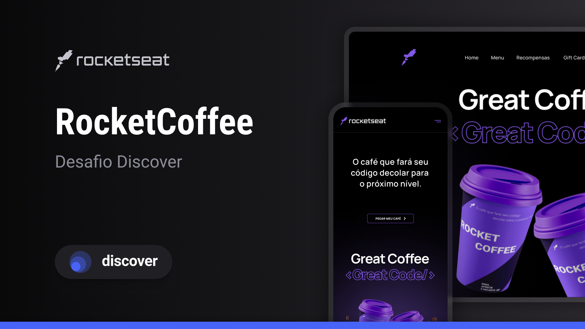

# RocketCoffee
Site feito a partir de um layout do figma pra praticar html e css.

## Tecnologias
- HTML  
- CSS  
- Git  
- JavaScript

## Layout
O layout está disponível na biblioteca Explorer do curso da Rocketseat.  
[link](<https://www.figma.com/file/pvcz8WiRONl2xoGnha21WW/RocketCoffee-%E2%80%A2-Desafio-Discover-(Community)?mode=dev>) do figma.

  

